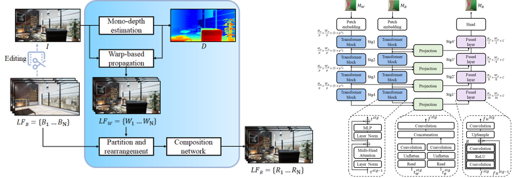

# Micro-cells Enabling Spatio-Angular Joint Attention for High-resolution Light Field Editing


## Overall Pipeline & Network Architecture  

The left image shows the overall pipeline of LF Editing, and the right image illustrates the architecture of the Composition Network.

## Setup


## Usage
1. Generate a CSV file by writing the file paths of the Train, Validation, and Test images.
2. Run a Light Field Editing model:  
```bash  
python main.py --train_path <path/to/train.csv> --val_path <path/to/val.csv>